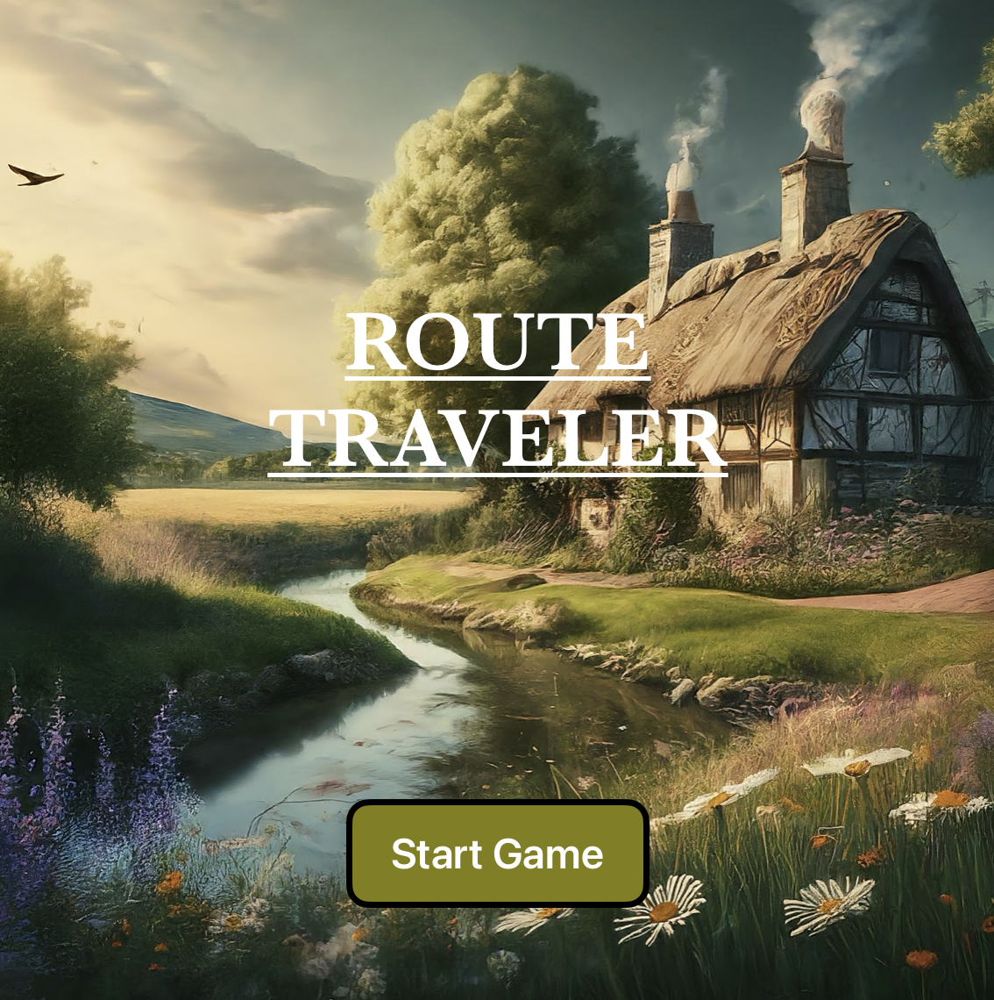
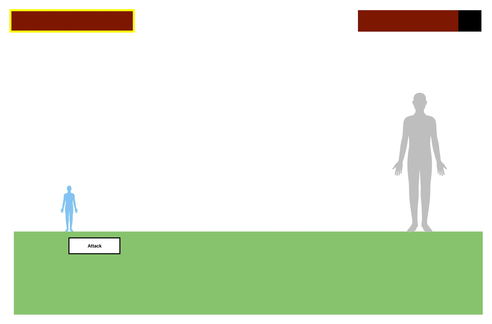
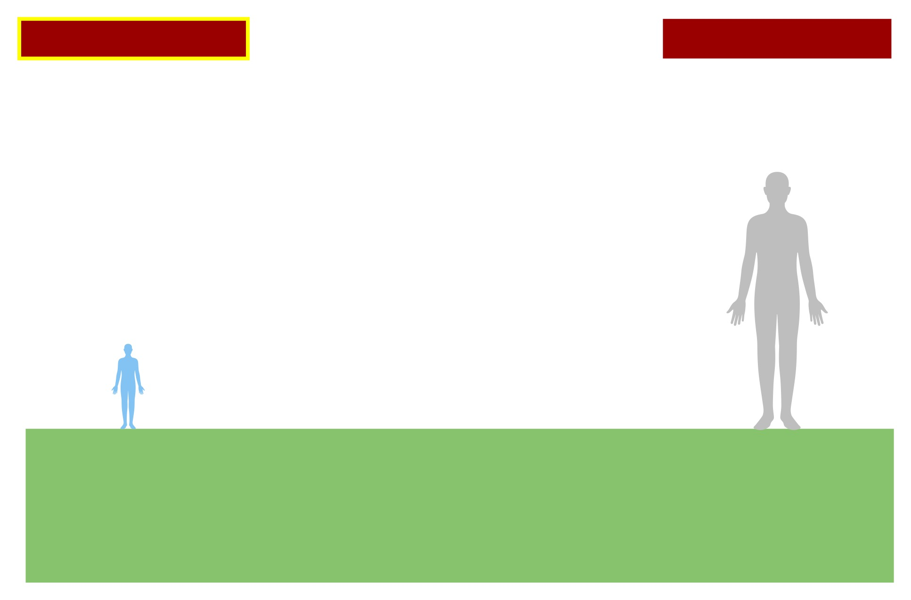
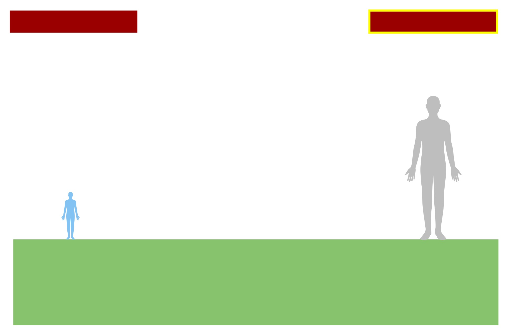
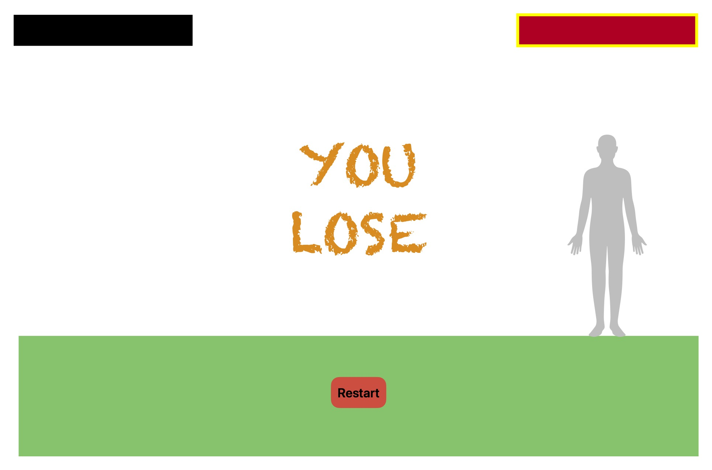
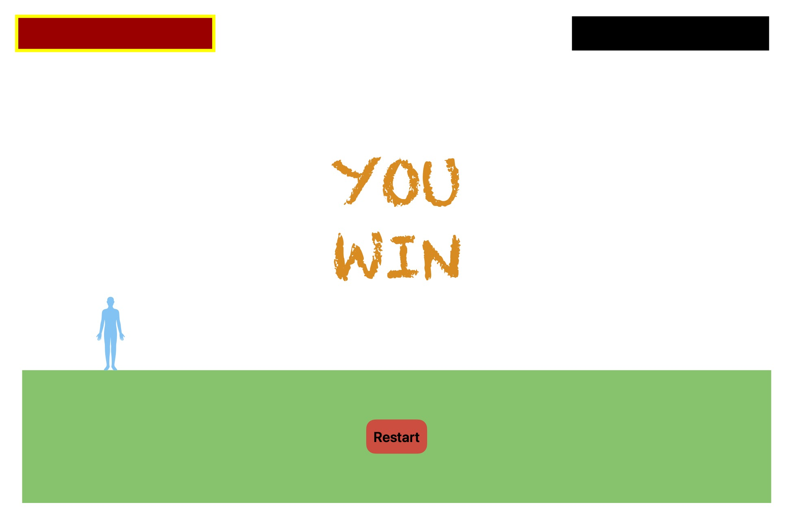
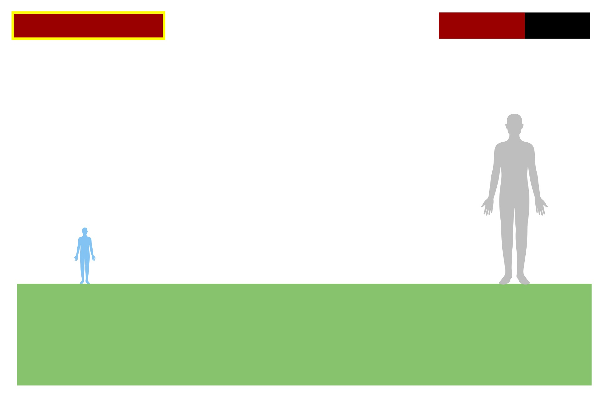

# Project Description

The browser-based game I am making is called Route Roamer. It is a one-player game where the character goes into battle with various creatures. The goal is to defeat the creatures in battle. If you take too much damage before defeating the enemy, you lose. My future goal for the game is adding additional playable characters and levels.

# Wireframes

## Start Page

## Selecting Attack

## Player's Turn

## Enemy's Turn

## Player Loses

## Player Wins

## Decreased Health

# User Stories

## MVP Goals

- As a player, I want to engage in battle with the enemy
- As a player, I want to attack the enemy using a simple attack action so that I can defeat them in battle.
- As a player, I want to see my character's and enemy's health bars so that I can monitor our health status during battles.
- As a player, I want to win the game by defeating the enemy so that I can complete the game.
- As a player, I want to lose the game if my character's health reaches zero.
- As a player, I want to see a start screen with a play button so that I can begin the game when I'm ready.
- As a player, I want to see a game over screen with a restart button so that I can try again if I lose.

## Stretch Goals

- As a player, I want to choose from multiple characters so that I can have varied gameplay experiences.
- As a player, I want to battle multiple enemies
- As a player, I want to hear sound effects and background music so that the game is more immersive and enjoyable.
- As a player, I want to battle a boss after defeating regular enemies

# Timeline

## Monday:

<u>HTML</u>: Create the basic HTML structure for the game area.

<u>CSS</u>: Set up a basic CSS file to style the game area and any UI elements.

<u>JavaScript</u>: Initialize a JavaScript file and set up the game loop structure.

## Tuesday:

<u>HTML/CSS</u>: Create the character and enemy elements using HTML and CSS.

<u>JavaScript</u>: Write the JavaScript functions to control the character's actions.

## Wednesday:

<u>JavaScript</u>: Implement the battle mechanics, including attacking, taking damage, and enemy AI.

## Thursday:

<u>JavaScript</u>: Develop the game's win/lose conditions.

## Friday:

<u>HTML/CSS</u>: Design and implement the user interface, including health bars.

<u>JavaScript</u>: Add event listeners and functions to update the UI based on game events.

## Saturday:

Thoroughly test the game for bugs and issues. Debug and fix any problems that arise.

## Sunday:

Polish the game by refining the design, improving performance, and ensuring a smooth user experience.
Start planning for future additions to the game, such as new characters.

# Pseudocode

Initialize playerHealth, playerMana, enemyHealth, playerPotions, isPlayerTurn, and difficulty

Function updateStats:
    Update the displayed player and enemy stats on the webpage

Function addMessage(message):
    Add a message to the message log on the webpage

Function clearMessages:
    Clear all messages from the message log

Function enableButtons:
    Enable all action buttons

Function playerAttack:
    If it's the player's turn:
        Calculate and apply damage to the enemy
        Update stats and check for game over
        Set isPlayerTurn to false
        If the enemy is still alive, initiate the enemy's turn
        Trigger a visual effect for the enemy being attacked

Function playerHeal:
    If it's the player's turn and the player has enough mana:
        Heal the player and deduct mana
        Update stats
        Set isPlayerTurn to false
        Initiate the enemy's turn
        Trigger a visual effect for the player healing

Function playerMagic:
    Similar to playerHeal, but for a magic attack

Function playerSpecialSkill:
    Similar to playerMagic, but for a special skill attack

Function playerUsePotion:
    If it's the player's turn and the player has potions:
        Heal the player and deduct a potion
        Update stats
        Set isPlayerTurn to false
        Initiate the enemy's turn

Function enemyTurn:
    If the enemy is alive:
        Randomly choose between attack and heal actions for the enemy
        Apply the chosen action and update stats
        Check for game over
        Set isPlayerTurn to true

Function checkGameOver:
    If either the player or the enemy has 0 or less health:
        Display the game over overlay with the appropriate message
        Disable all action buttons

Function startGame:
    Reset player and enemy stats based on the selected difficulty
    Clear messages, update stats, enable buttons, and add a starting message

Function setDifficulty(diff):
    Set the difficulty level and restart the game

Add event listeners to the buttons for player actions and difficulty selection

Call startGame to initialize the game

