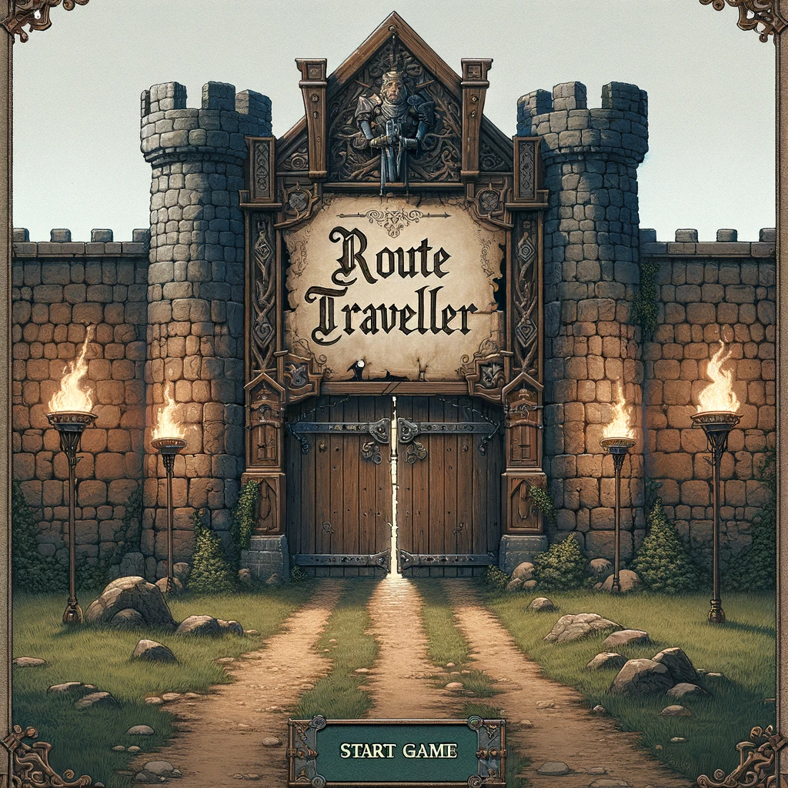
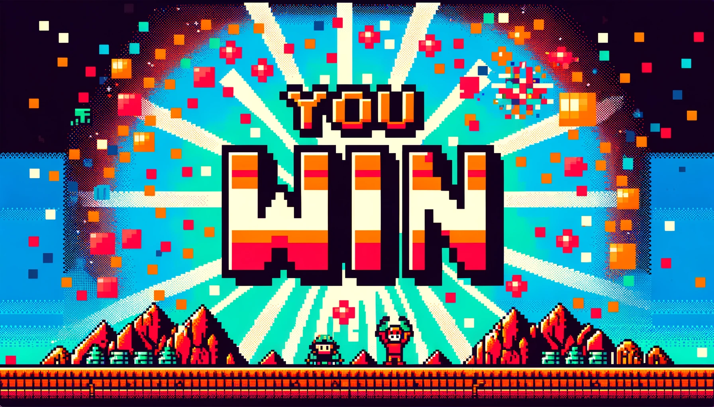

# Project Description

The browser-based game I am making is called Route Traveler. It is a one-player game where the character goes into battle with various creatures. The goal is to defeat the creatures in battle. If you take too much damage before defeating the enemy, you lose. My future goal for the game is adding additional playable characters and levels.

# Wireframes

## Initial Landing View

## Results View

# User Stories

## MVP Goals

- As a player, I want to engage in battles with enemy creatures so that I can progress through the game.
- As a player, I want to attack enemies using a simple attack action so that I can defeat them in battle.
- As a player, I want to see my character's and enemies' health bars so that I can monitor our health status during battles.
- As a player, I want to win the game by defeating all enemies so that I can complete the game.
- As a player, I want to lose the game if my character's health reaches zero so that there are consequences for failing in battle.
- As a player, I want to see a start screen with a play button so that I can begin the game when I'm ready.
- As a player, I want to see a game over screen with a retry button so that I can try again if I lose.

## Stretch Goals

- As a player, I want to choose from multiple characters so that I can have varied gameplay experiences.
- As a player, I want to encounter a variety of enemies with different attack patterns so that battles remain interesting.
- As a player, I want to hear sound effects and background music so that the game is more immersive and enjoyable.
- As a player, I want to progress through multiple levels with increasing difficulty so that the game remains challenging.

# Timeline

## Monday:

<u>HTML</u>: Create the basic HTML structure for the game area.

<u>CSS</u>: Set up a basic CSS file to style the game area and any UI elements.

<u>JavaScript</u>: Initialize a JavaScript file and set up the game loop structure.

## Tuesday:

<u>HTML/CSS</u>: Create the character and enemy elements using HTML and CSS.

<u>JavaScript</u>: Write the JavaScript functions to control the character's actions.

## Wednesday:

<u>JavaScript</u>: Implement the battle mechanics, including attacking, taking damage, and enemy AI.

## Thursday:

<u>JavaScript</u>: Develop the game progression system for enemy spawning and win/lose conditions.

## Friday:

<u>HTML/CSS</u>: Design and implement the user interface, including health bars and game messages.

<u>JavaScript</u>: Add event listeners and functions to update the UI based on game events.

## Saturday:

Thoroughly test the game for bugs and issues. Debug and fix any problems that arise.

## Sunday:

Polish the game by refining the design, improving performance, and ensuring a smooth user experience.
Start planning for future additions to the game, such as new characters.

# Pseudocode
// Initialize game state
Initialize game variables (player health, enemy health, game status)

// Load game assets
Load assets (images, sounds, etc.)

// Set up event listeners
Set up event listeners for user input (e.g., attack button, retry button)

// Main game loop
While game is not over:
    // Update game state
    Update player and enemy positions and actions

    // Check for battle outcomes
    If player attacks enemy:
        Reduce enemy health
        If enemy health <= 0:
            Enemy is defeated
            Check if all enemies are defeated
                If yes, player wins the game
                If no, spawn next enemy
    If enemy attacks player:
        Reduce player health
        If player health <= 0:
            Player loses the game

    // Update game UI
    Update health bars, game messages, etc.

    // Render game frame
    Draw game area, characters, and UI elements

// Game over
If player wins:
    Display victory message and retry button
If player loses:
    Display game over message and retry button

// Event handlers
Function for attack button:
    Player attacks enemy

Function for retry button:
    Reset game state
    Start game loop again