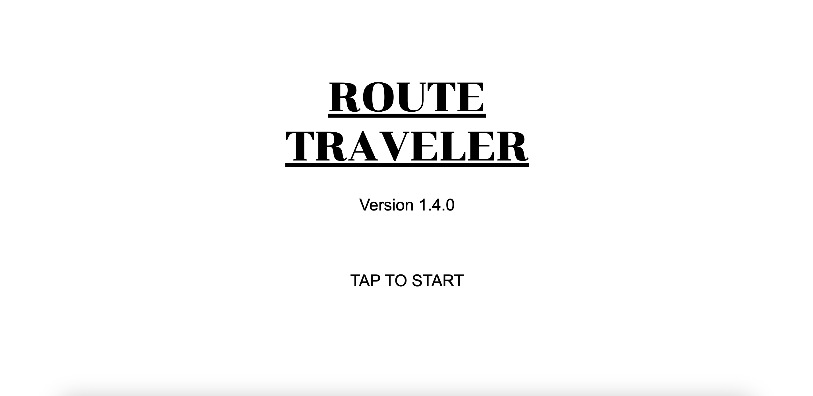

# Route Traveler

## Description

"Route Traveler" is a turn-based RPG game where you play as the hero, Aldric, fighting against the formidable enemy, Varick. The game features a simple battle system where you can attack, heal, use magic, and utilize special skills to defeat your opponent. The inspiration for this game came from classic RPGs and a desire to create an engaging battle experience in the browser.

## Technologies Used

- HTML
- CSS
- JavaScript

## Getting Started

To play "Route Roamer" visit the deployed game at [https://orlandoolave-routetraveler.netlify.app](#). Here are some instructions to get you started:
- Use the **Attack** button to deal damage to the enemy.
- Use the **Heal** button to restore your health (costs mana).
- Use the **Magic** button to cast a spell for extra damage (costs mana).
- Use the **Use Item** button to use a potion to heal.
- Use the **Special Skill** button to unleash a powerful attack (costs mana).
- Defeat all enemies to win the game.
- If your health reaches zero, the game is over. Click the "Retry" button to try again.

## Screenshots

### Message Updates

### Title Screen

### Battle Screen

### You Win Screen

### Game Over Screen

## Timeline

| Date       | MVP Item              | Met Goal (Y/N) | Notes               |
|------------|-----------------------|----------------|---------------------|
| 2024-03-18 | Basic game setup   | Y              |                     |
| 2024-03-19 | Player actions | Y              |                     |
| 2024-03-20 | Enemy behavior      | Y              |                     |
| 2024-03-21 | Battle system     | Y              |                     |
| 2024-03-22 | UI & Feedback   | N              |                     |
| 2024-03-23 | Difficulty levels    | Y              |                     |
| 2024-03-24 | Sounds and animations  | Y              |                     |

## Monday:

<u>HTML</u>: Create the basic HTML structure for the game area.

<u>CSS</u>: Set up a basic CSS file to style the game area and any UI elements.

<u>JavaScript</u>: Initialize a JavaScript file and set up the game loop structure.

## Tuesday:

<u>HTML/CSS</u>: Create the character and enemy elements using HTML and CSS.

<u>JavaScript</u>: Write the JavaScript functions to control the character's actions.

## Wednesday:

<u>JavaScript</u>: Implement the battle mechanics, including attacking, taking damage, and enemy AI.

## Thursday:

<u>JavaScript</u>: Develop the game's win/lose conditions.

## Friday:

<u>HTML/CSS</u>: Design and implement the user interface, including health bars.

<u>JavaScript</u>: Add event listeners and functions to update the UI based on game events.

## Saturday:

Thoroughly test the game for bugs and issues. Debug and fix any problems that arise.

## Sunday:

Polish the game by refining the design, improving performance, and ensuring a smooth user experience.
Start planning for future additions to the game, such as new characters.

## Attributions

- [Google Fonts](https://fonts.google.com/) for the "Press Start 2P" font.
- [Freesound](https://freesound.org/) for battle music and sound effects.

## Next Steps

Future enhancements for "Route Traveler" include:
- Multiple playable characters
- Adding more enemies with unique abilities.
- Implementing an inventory system for items and equipment.
- Story mode
- Walkin the grass for enemy battle encounters.

## Author
- Orlando (Lando) Olave
